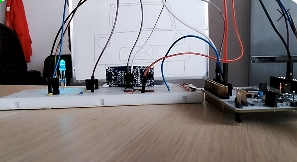

# Título del proyecto

## Authors

* **Eneko Emilio Sendin** - email: [enekoemilio.sendin@alumnos.upm.es](mailto:enekoemilio.sendin@alumnos.upm.es)
* **Rodrigo Gutierrez** - email: [rodrigo.gutierrez@alumnos.upm.es](mailto:rodrigo.gutierrez@alumnos.upm.es)

Ponga una breve descripción del proyecto **Sensor de Aparcamiento de Coche** en castellano e inglés.

Puede añadir una imagen de portada **de su propiedad** aquí. Por ejemplo, del montaje final, o una captura de osciloscopio, etc.

**Las imágenes se deben guardar en la carpeta `docs/assets/imgs/` y se pueden incluir en el documento de la siguiente manera:**

```markdown

```

NOTA: **NO** añada el código ```markdown``` en el fichero `README.md` de su proyecto, sino lo de dentro. Este código es un para mostrar de forma literal cómo se puede añadir una imagen al fichero `README.md`.

**Añada un enlace a un vídeo público de su propiedad aquí con la demostración del proyecto explicando lo que haya hecho en la versión V5.**

Para añadir un enlace a un vídeo de Youtube, puede usar el siguiente código:


[](https://youtu.be/iM3k7JMAz8s "Texto al pasar el ratón por encima de la imagen.")


NOTA: **NO** añada el código ```markdown``` sino lo de dentro. Este código es un para mostrar de forma literal cómo se puede añadir un enlace a un vídeo de Youtube al fichero `README.md`.

# Version 1

## Descripción
En la **Versión 1**, el sistema funciona solo con el **botón de usuario**.

- **Botón de usuario**: Conectado al pin `PC13`.
- **Interrupción utilizada**: `EXTI13` para detectar la pulsación del botón.

---

## Configuración del Botón

| **Parámetro**  | **Valor** |
|---------------|-----------|
| **Pin**       | `PC13` |
| **Modo**      | Entrada (`Input`) |
| **Pull-up/down** | No pull |
| **EXTI**      | `EXTI13` |
| **ISR**       | `EXTI15_10_IRQHandler` |
| **Prioridad** | 1 |
| **Subprioridad** | 0 |
| **Tiempo de debounce** | 100-200 ms |

---

# Versión 2

## Descripción
En la **Versión 2**, el sistema agrega un **transceptor ultrasónico** para medir la distancia a un objeto.

- **Trigger pin**: Conectado al pin `PB0`.
- **Echo pin**: Conectado al pin `PA1`.
- **Timers utilizados**: `TIM2`, `TIM3` y `TIM5` para el control del transceptor ultrasónico.

Para medir la distancia en **centímetros** con una resolución de temporizador de **1 microsegundo**, se considera que **1 cm equivale a 58.3 microsegundos**. La velocidad del sonido es **343 m/s a 20ºC**. El transceptor ultrasónico utilizado es el **HC-SR04**.

---

## Características del HC-SR04

| **Parámetro**       | **Valor**                           |
|----------------------|---------------------------------|
| **Alimentación**    | 5 V                             |
| **Corriente**       | 15 mA                           |
| **Ángulo de apertura** | 15º                             |
| **Frecuencia**      | 40 kHz                          |
| **Rango de medición** | 2 cm a 400 cm                   |
| **Pines**          | `PB0` (Trigger) y `PA1` (Echo)  |
| **Modo**           | Salida (Trigger) y alternativo (Echo) |
| **Pull-up/down**   | No pull                          |
| **Temporizador**   | `TIM3` (Trigger) y `TIM2` (Echo) |
| **Canal**          | 2 |

---

## Temporizadores Utilizados

El sistema emplea **tres temporizadores**:
1. **TIM3**: Controla la duración de la señal de disparo (*Trigger*).
2. **TIM2**: Mide el tiempo del eco.
3. **TIM5**: Controla el tiempo de espera entre mediciones.

### Configuración de TIM3 (Trigger)

- Se genera una señal de **al menos 10 microsegundos**.
- Configuración:

| **Parámetro**  | **Valor** |
|---------------|-----------|
| **Temporizador** | `TIM3` |
| **Prescaler**  | Calculado por función *_timer_trigger_set_up()* |
| **Período**    | Calculado por función *_timer_trigger_set_up()* inicialmente 10us |
| **ISR**       | `TIM3_IRQHandler()` |
| **Prioridad** | 4 |
| **Subprioridad** | 0 |

### Configuración de TIM2 (Medición del Eco)

- Se configura en **modo de captura de entrada**.
- Captura el valor del contador en el momento en que la señal de eco se **activa y desactiva**.

| **Parámetro**  | **Valor** |
|---------------|-----------|
| **Temporizador** | `TIM2` |
| **Prescaler**  | Calculado por función *_timer_echo_set_up()* |
| **Período**    | Calculado por función *_timer_echo_set_up()* inicialmente 1 us |
| **ISR**       | `TIM2_IRQHandler()` |
| **Prioridad** | 3 |
| **Subprioridad** | 0 |

### Configuración de TIM5 (Tiempo entre mediciones)

- Controla el **timeout** entre mediciones consecutivas.
- La **FSM** proporcionará un valor cada 100 milisegundos.

| **Parámetro**  | **Valor** |
|---------------|-----------|
| **Temporizador** | `TIM5` |
| **Prescaler**  | Calculado por función *_timer_new_measurement_setup()* |
| **Período**    | Calculado por función *_timer_new_measurement_setup()* inicialmente 100 ms |
| **ISR**       | `TIM5_IRQHandler()` |
| **Prioridad** | 5 |
| **Subprioridad** | 0 |

# Version 3

En la Versión 3, el sistema incluye una pantalla utilizando un LED RGB. El LED RGB está conectado a los pines PB6 (rojo), PB8 (verde) y PB9 (azul). El sistema utiliza el temporizador TIM4 para controlar la frecuencia de la señal PWM para cada color. Esta configuración permite que el LED RGB indique visualmente la distancia a un objeto.

## Características de la Pantalla

| **Parámetro**              | **Valor**                                                      |
| ---------------------- | ---------------------------------------------------------- |
| **Pin LED rojo**           | PB6                                                        |
| **Pin LED verde**          | PB8                                                        |
| **Pin LED azul**           | PB9                                                        |
| **Modo**                   | Alternativo                                                |
| **Pull up/down**           | Sin resistencia pull                                       |
| **Temporizador**           | TIM4                                                       |
| **Canal LED rojo**         | Funcion Alternativa 2 y Canal 1                            |
| **Canal LED verde**        | Funcion Alternativa 2 y Canal 3                            |
| **Canal LED azul**         | Funcion Alternativa 2 y Canal 4                            |
| **Modo PWM**               | Modo PWM 1                                                 |
| **Prescaler**              | A calcular para una frecuencia de 50 Hz                    |
| **Período**                | A calcular para una frecuencia de 50 Hz                    |
| **Ciclo de trabajo rojo**  | Variable (depende del color a mostrar)                     |
| **Ciclo de trabajo verde** | Variable (depende del color a mostrar)                     |
| **Ciclo de trabajo azul**  | Variable (depende del color a mostrar)                     |

## Mapeo de Distancia a Color

La siguiente tabla define los **valores del ciclo de trabajo** según la distancia medida. Estos no son los valores directos que se insertan en el registro `CCR` deben ser escalados con `PORT_DISPLAY_RGB_MAX_VALUE`, es decir si el valor es 37% será 37% de 255.

| **Distancia (cm)**  | **Color**          | **LED rojo** | **LED verde** | **LED azul** |
| --------------- | -------------- | -------- | --------- | -------- |
| **\[0-25]**         | Rojo (peligro) | 100%     | 0%        | 0%       |
| **\[25-50]**        | Amarillo       | 37%      | 37%       | 0%       |
| **\[50-150]**       | Verde          | 0%       | 100%      | 0%       |
| **\[150-175]**      | Turquesa       | 10%      | 35%       | 32%      |
| **\[175-200]**      | Azul           | 0%       | 0%        | 100%     |
| **>200 o inválido** | Apagado        | 0%       | 0%        | 0%       |


# Version 4

En la Versión 4, el sistema completa su máquina de estados (FSM) para interactuar con el botón del usuario, el transceptor ultrasónico y la pantalla. Además, el sistema muestra la distancia al objeto detectado en la pantalla.

En esta versión se implementan unas funciones para gestionar el modo sleep de *BAJO CONSUMO* del sistema. Esto se ve en los 2 estados de la FSM de Urbanite: **SLEEP_WHILE_ON** y **SLEEP_WHILE_OFF**. Estos estados comprueban si alguna de las FSM de los elementos está
activa, y en caso de que todas estén inactivas, se duerme. El sistema solo se despertará con una interrupción de un timer o externa (pulsación de botón)

Para distinguir si la Urbanite se debe pausar o apagar se mide el tiempo que está pulsado el botón.

* **URBANITE_ON_OFF_PRESS_TIME_MS** 1000 `pulsacion larga`
* **URBANITE_PAUSE_DISPLAY_TIME_MS** 100 `pulsacion corta`

Teoricamente la pulsación larga del botón indica el inicio de la marcha atrás de un coche y por tanto se enciende el sistema de aparcamiento Urbanite, y la pulsación corta servirá para pausar el display.

---

## FUNCIONALIDADES de PLACA en V4

1. El botón enciende y apaga el sistema Urbanite.
2. Las distancias que se miden se muestran en la terminal del gdb-server, y el display se enciende de manera acorde.
3. Una pulsación corta pausa el display pero se siguen imprimiendo los mensajes de log en la terminal. Pero estando pausado, si la distancia es muy pequeña se enciende el LED en rojo para avisar de una colisión inminente.
4. Estando el sistema pausado, se puede apagar.
5. Al encender la placa, nunca está en pausa.
6. Estando apagada, la Urbanite no responde toma medidas ni muestra nada en el display.

---

# Version 5

Breve descripción de la versión 5.


| **Distancia (cm)**  | **Frecuencia del zumbador** | **Tiempo de pulso (en unidades de 25ms)** | 
| ------------------- | --------------------------- | ------------------- |
| **\[0-25]**         | \[*DO*] 261 Hz  | Continuo     |
| **\[25-50]**        | \[*RE*] 293 Hz  | 5      |
| **\[50-150]**       | \[*MI*] 329 Hz  | 10       |
| **\[150-175]**      | \[*FA*] 349 Hz  | 15      |
| **\[175-200]**      | \[*SOL*] 392 Hz  | 20       |
| **>200 o inválido** | Apagado  | No hay       |

| **Parámetro**              | **Valor**                                                      |
| ---------------------- | ---------------------------------------------------------- |
| **Pin Buzzer (PWM)**           | PC7                                             |
| **Canal LED buzzer**          | Función Alternativa 3 y Canal 2                      |
| **Modo**                   | Alternativo                                                |
| **Pull up/down**           | Sin resistencia pull                                       |
| **Temporizador**           | TIM8                                                       |
| **Modo PWM**               | Modo PWM 1                                                 |
| **Prescaler**              | A calcular para una frecuencia Variable                   |
| **Período**                | A calcular para una frecuencia Variable                    |
| **Ciclo de trabajo**       | 50%                     |

| **Parámetro**              | **Valor**                                                      |
| ---------------------- | ---------------------------------------------------------- |
| **Timer de semi-periodos** | TIM9                             |
| **Prescaler**              | A calcular para un periodo de 25ms  (*15999*) ;         |
| **Período**                | A calcular para un periodo de 25ms (*24*)               |

